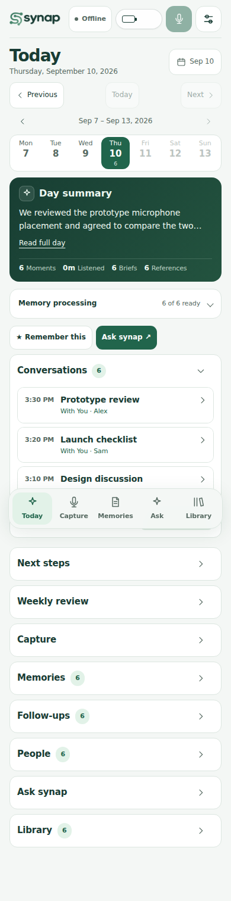
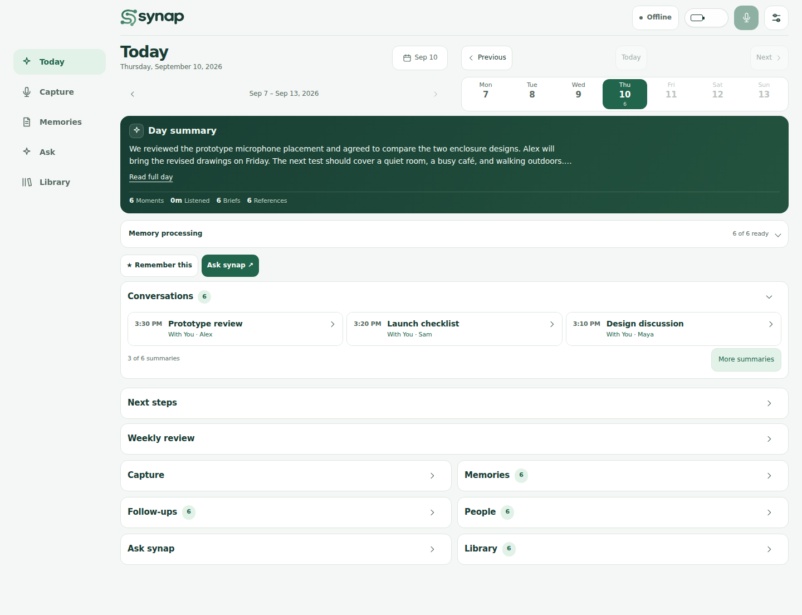
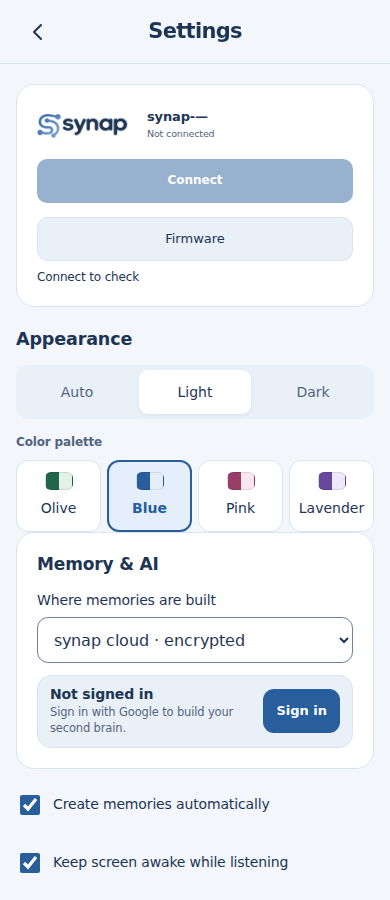
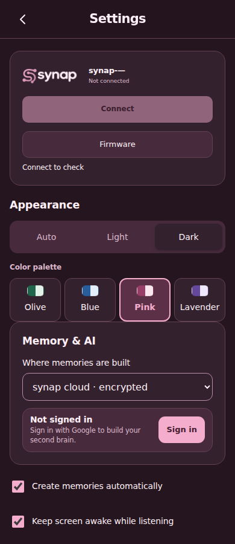

# Compact workspace and color palettes

The day view now uses a short summary, inline stats and compact conversation cards. Individual conversation and memory details start closed. Secondary sections—Next steps, Weekly review, Capture, Memories, Follow-ups, People, Ask and Library—become expandable tiles. Repeated introductions, duplicate shortcuts and decorative labels are removed from the initial view.

Navigation and source links open the destination automatically. Live capture opens its controls, and the header start/stop shortcut remains available. Collapsing Library pauses playback while retaining the player, playback position and notes. Manual tile choices persist in this browser. Memory cards retain their open state during refresh, and tiles use keyboard-operable buttons with `aria-expanded` and `aria-controls`.

Settings → Appearance adds **Olive**, **Blue**, **Pink** and **Lavender**. Palette and appearance use independent storage keys; changing a palette never changes Auto/Light/Dark. Auto still follows the existing local-time schedule: light from 7 AM to 7 PM, dark otherwise. Backgrounds, controls, waveform colors, browser chrome and explicit light/dark logo PNGs follow the selected palette. Invalid or unavailable storage falls back gracefully. The installed launcher icon retains its original identity.

## Measured space reduction

Compared with main commit `da4f4f4`, using the same six generated recordings at a 900 px viewport height and default disclosure states. This measures the initial page, not the amount of retained information; opening tiles reveals their complete content.

| Viewport width | Previous page height | Compact page height |
| --- | ---: | ---: |
| 390 px | 13,447 px | 1,513 px |
| 1440 px | 6,862 px | 1,104 px |

Run `tools/compact-layout-smoke.cjs` with `SYNAP_UI_ROOT` pointing to a baseline checkout and `SYNAP_BASELINE=1` to reproduce the baseline. The default run verifies current behavior and saves measurements and screenshots. These fixtures stay in isolated localhost profiles.

## Verification

- All 186 PWA tests pass. Palette tests cover readable text in all eight palette/mode combinations, including both ends of summary gradients and control contrast.
- Full browser regression passes light/dark at 320, 390, 768 and 1440 px, including source navigation, day/week browsing, Library playback/export, speech enhancement and People controls.
- Additional browser checks cover keyboard toggles, automatic destination expansion, capture visibility, player/note identity, memory refresh, all palette logos, account-button contrast, preference persistence and Auto mode transitions.

