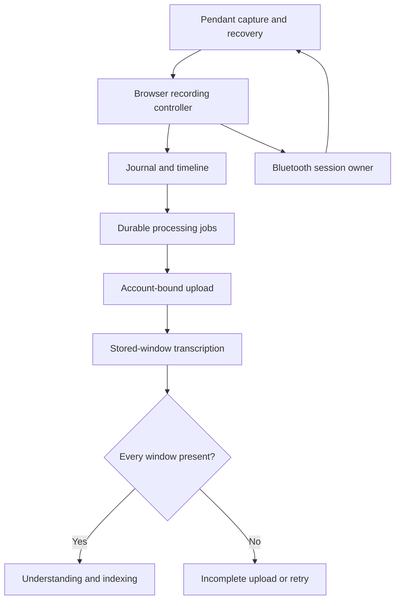

# Recording architecture audit — 13 September 2026

The recording path has working recovery mechanisms, but ownership was fragmented.
The highest-value structural change is to make one component own each operation's
lifetime: native Bluetooth requests, journal writes, cloud window transcription,
and the account under which a job runs.

This audit includes source review and executable regressions. It does **not**
establish the physical cause of the reported C3/S3 link drops. No new pendant
diagnostic log or physical board was available for this pass.

## Scope and baseline

| Layer | Reviewed boundaries | Baseline |
| --- | --- | --- |
| Firmware | I2S lifecycle, filtering/ADPCM, capture/transmit/control tasks, recovery ring, STOP drain, connection generations, diagnostics, power/gestures, OTA | `synap-firmware@dbd548d251e8c6d51d8a442ce48a1fb1f12257df` |
| Board support | Shared sketch, C3 materialization, pins, battery overrides, single-core task creation, build/publication workflow | Same firmware commit |
| Browser | Connection/discovery, serialized GATT, reconnect ownership, START/STOP, packet decoding, IndexedDB, rolling windows, export and job scheduling | `synap-pwa@8c09dce1090a79f6d6876e9d16cca0dd431aa97e` |
| Cloud | Account/session lifecycle, upload retries, segment finalization, ASR, processing workers, encrypted persistence, derived indexing | Same PWA commit |
| Delivery | Static bootstrap/offline cache, backend deployment, speaker-service boundary, regression coverage | Same PWA commit |

The baseline browser declared 57 external scripts; the revised graph declares
58 after replacing two implicit storage patches with three explicit modules.
Reducing the script count is secondary to removing duplicate ownership.

## Confirmed findings and changes

| Priority | Finding | Change and evidence |
| --- | --- | --- |
| High | A queued START could execute after the user requested Stop. | Check the recording session and Stop intent immediately before the native write. The browser regression blocks an idle read, starts then stops, releases the read, and verifies zero additional START commands. |
| High | Finalize accepted a count of uploaded windows without requiring the exact sequence. A missing middle window could reach understanding. | Validate every expected index before dispatch and again in final processing. Missing, duplicate, extra and absent-source windows fail explicitly. Invalid timing headers are rejected before storage. |
| High | Upload and final processing had different transcription implementations. The latter could mark a missing audio object failed and then continue building partial memory. | Both paths use the stored-window worker. A failed worker is propagated; other active workers settle before the stage reports failure. Already completed windows are reused. |
| High | Managed jobs did not enforce saved account ownership; a late token refresh could replace a newer account session. | Pin jobs/requests to the account, check or claim local ownership before cloud work, abort on account change, key creation caches by account, and discard stale refresh successes/failures. Cloud history records its owner and refuses a conflicting merge. |
| Medium | Sequence and rolling helpers globally replaced `AudioStore` methods at load time. Behavior depended on load order and shared module state. | Remove both prototype patches. `AudioStore` owns window sealing and lifecycle barriers; per-store timeline objects own pendant sequence normalization. Capture callers explicitly provide configuration. |
| Medium | Late packets preceding the recording origin were clamped to sequence zero. | Ignore a negative relative sequence so older data cannot replace the first frame. Desktop logical counters bypass pendant normalization. |
| Medium | Close could overlap another close or accept new appends; pending writes could recreate deleted packets. | Claim close synchronously, coalesce concurrent callers, retain failed-save data/timeline for retry, and await pending window/write work before deletion. |
| Medium | Bluetooth queue lifetime and UI/recording policy were mixed in `app.js`. | Extract native serialization, ownership invalidation and deadline behavior into `recording/bluetooth-session.js`. Recording policy retains the decision about whether a timeout warrants disconnecting. |

These are code-level defects and structural risks. They are not evidence that
each one occurred in the user's physical recording.

## Resulting structure

| Owner | Responsibility | Must not own |
| --- | --- | --- |
| `recording/bluetooth-session.js` | Serialize native requests, retain a timed-out native operation until it settles, reject stale work | Recording UI, retry scheduling, firmware policy |
| `app.js` | Connection/recording decisions and coordination | A second native request queue or storage implementation |
| `recording/timeline.js` | Per-store uint16 unwrapping and explicit transport restart | DOM controls, global storage patches |
| `recording/journal.js` | Explicit capture options, account metadata, post-commit queue wakeups | Replacing journal prototypes |
| `audio-store.js` | Buffer/flush, IndexedDB transactions, complete windows, close/delete barriers, job persistence | Bluetooth reconnect or model calls |
| `processing-queue.js` | Bounded job concurrency, cancellation and durable retries | Audio decoding or provider credentials |
| `synap-backend.js` | Account-bound cloud requests and local/cloud processing state | Native Bluetooth or editing original PCM |
| `backend/src/pipeline/recording-segments.ts` | Exact window completeness and worker completion | HTTP authentication or raw storage access |
| `backend/src/pipeline/rolling-transcription.ts` | Transcribe one encrypted stored window and persist the result | Deciding that an incomplete recording is ready |

The firmware protocol, PCM/ADPCM format, device identity and IndexedDB schema stay
compatible. This change does not require another firmware flash.

## Firmware and audio assessment

The common firmware already separates execution into capture, transmit and
control tasks. Its microphone mutex, recording and connection generations,
idempotent START, yielding notification retries and bounded STOP drain are
meaningful safeguards. Native regressions exercise the production functions for
both generated targets; **51 tests passed** in this audit.

The S3 can buffer up to 30 seconds in PSRAM. Internal-memory fallback is up to
5 seconds and depends on successful allocation; C3 cannot be assumed to have a
30-second buffer. The 60-second firmware handshake and five-minute browser
reconnect window are retry bounds, not audio retention guarantees.

The earlier C3 WAV contained 36.1 seconds of all-zero frames. The S3 sample had
about 6.11 seconds at the digital floor after startup transients, without entire
all-zero transport frames. These are different signal observations. Neither WAV
can identify a supervision timeout, phone suspension, reboot or electrical fault.
Increasing gain cannot recover speech that was never captured.

The Gemini request's model, verbatim annotation structure and automatic-language
behavior were compared with Google's current
[transcription documentation](https://ai.google.dev/gemini-api/docs/transcribe).
The earlier bounded HTTP-400 fallback remains in place. The reported production
400 cannot be attributed to a specific request field without its diagnostic
context; real provider requests were not made with user audio in this audit.

## Validation

- App behavior checks cover native queue ownership, stale callbacks, queued
  START cancellation, transport wrap/restart, storage close/delete barriers,
  account changes, upload retries and the existing product flows.
- Real IndexedDB browser checks replay the missing frames across a 30-second
  boundary and compare exported PCM sample by sample. Unrecovered gaps retain
  their duration and warning; partial evidence remains stored.
- Browser connection checks use simulated C3/S3 pendants and exercise repeated
  recovery within one take, Stop during recovery, stuck native writes, retained
  links, hardware-start adoption and OTA controls.
- Backend checks cover complete-window validation, worker failure ordering,
  transcript preservation, encryption, auth boundaries and Gemini fallback.
- Publication requires the app, backend and browser CI jobs on the exact commit.
  Verify the deployed browser assets and backend health commit after publication.

## Remaining work, in priority order

1. **Physical disconnect diagnosis:** retain the post-disconnect log, installed
   build and board target. Compare app-requested disconnects with peripheral
   reasons, reset/uptime evidence and capture/notification counters. Validate long
   recordings on both boards, including brief interruptions and Stop recovery.
   No claim of RF, battery or microphone reliability follows from simulated tests.
2. **Derived indexing retry atomicity — addressed in the readiness pass:**
   processing claims now have ownership fences, completed understanding is reused,
   and derived rows plus the ready checkpoint publish in one Firestore transaction.
   Legacy duplicate actions encountered during a retry retain completion state.
   Existing historical people overcounts cannot be reconstructed reliably from
   old partial writes; this change prevents new retry inflation.

3. **Firmware source structure:** the 1,906-line shared sketch is still the source
   for both boards. Checked C3 text substitutions fail loudly, but remain brittle
   boundaries. Move board configuration and pure codec/recovery components into
   explicit compiled interfaces in a dedicated firmware change with both pinned
   board builds and generated-source/release provenance checks.
4. **Browser presentation structure:** `app.js` still coordinates the Library as
   well as recording. Extract those controllers by responsibility, and replace
   overlapping legacy UI/CSS overrides as their behavior tests are migrated.
   Avoid another broad rename or formatter pass that obscures functional changes.

Legacy recordings without owner metadata are bound on their first managed sync;
their original account cannot be inferred retrospectively from a local UUID.
The app continues to retain local recordings on the current device. Upload
ownership checks do not make browser-local storage a multi-user security boundary.
